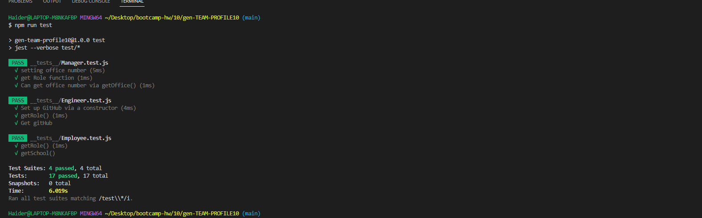
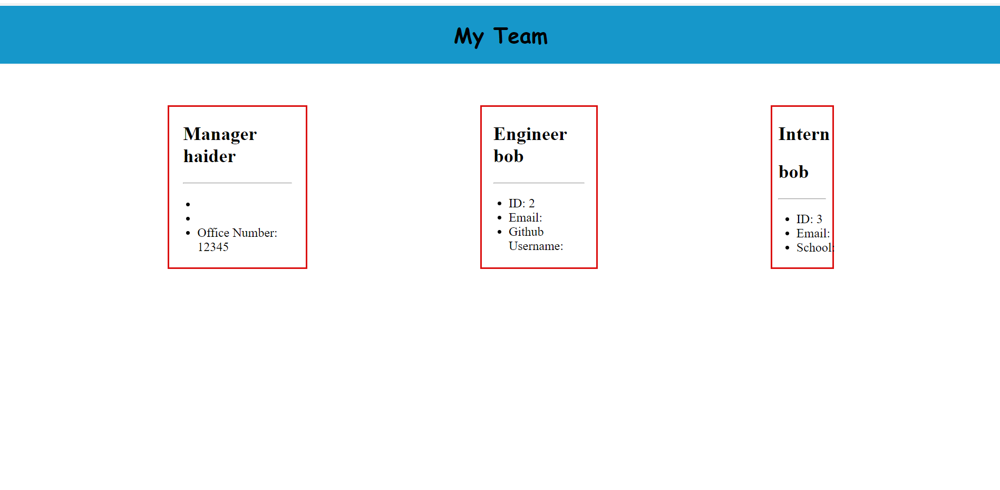

# gen-TEAM-PROFILE10

## user story

AS A manager
I WANT to generate a webpage that displays my team's basic info
SO THAT I have quick access to their emails and GitHub profiles

## Acceptance criteria

AS A manager
I WANT to generate a webpage that displays my team's basic info
SO THAT I have quick access to their emails and GitHub profiles

## Link to video

https://www.youtube.com/watch?v=CbB8dCfzGzU

## Screenshot of test

<section>
    
</section>

## Screenshot of generated HTML

<section>
    
</section>

